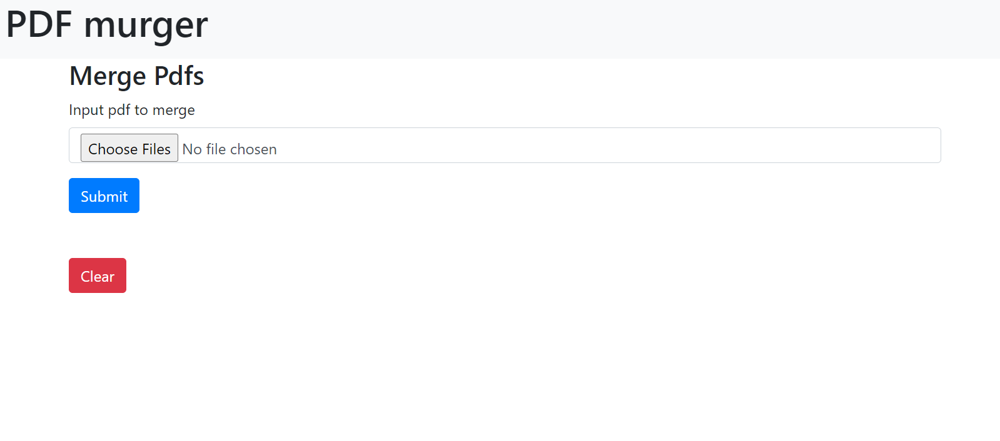

# PDF Merger 
**Small app use to merge multiple pdfs into a single pdf**
### dependecies used
   - Express.js
   - Multer
   - pdf-merger-js
   - fs module

### UI 
  

### Steps
  - Commands
     - `npm install`
     - `nodemon server.js`

